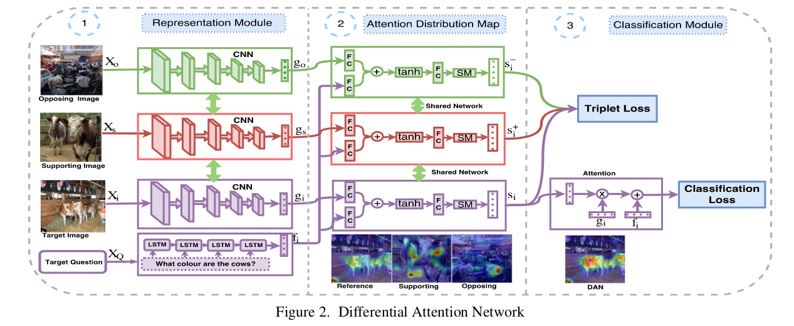

# VQA using Differential Attention Models

Pytorch implementation of the papers:
- VQA: Visual Question Answering (https://arxiv.org/pdf/1505.00468.pdf).
- Stacked Attention Networks for Image Question Answering (http://arxiv.org/abs/1511.02274)
- Differential Attention for Visual Question Answering (http://arxiv.org/abs/1804.00298)
 


## Usage 

#### 1. Clone the repositories.
```bash
git clone https://github.com/chirag26495/DAN_VQA.git
```

#### 2. Download and unzip the dataset from official url of VQA: https://visualqa.org/download.html.

```bash
cd basic_vqa/utils
chmod +x download_and_unzip_datasets.csh
./download_and_unzip_datasets.csh
```

#### 3. Preproccess input data for (images, questions and answers).

```bash
$ python resize_images.py --input_dir='../datasets/Images' --output_dir='../datasets/Resized_Images'  
$ python make_vacabs_for_questions_answers.py --input_dir='../datasets'
$ python build_vqa_inputs.py --input_dir='../datasets' --output_dir='../datasets'
```

#### 4. Train model for VQA task.

```bash
$ cd ..
$ python train.py
```

## Pretrained Models and Exemplar Mappings (using VQA2.0 dataset)

- Download: https://iiitaphyd-my.sharepoint.com/:f:/g/personal/adhiraj_deshmukh_research_iiit_ac_in/EvyW0gTi2LRNiJkhjq481zMBk9aRolCkIE-invan8o17hQ?e=dNvGIg

## Results

- Quantitative comparison on VQA2.0 Validation set 

| Model | Metric | Dataset | Accuracy |
| --- | --- | --- | --- |
| Basic (LQI) | All | VQA v2 | 47.61 |
| Baseline (LQIA) | All | VQA v2 | 53.23 |
| SAN-2 | All | VQA v2 | 55.28 |
| DAN + LQIA | All | VQA v2 | **55.49** |
| DAN-alt. + LQIA | All | VQA v2 | 54.16 | 


